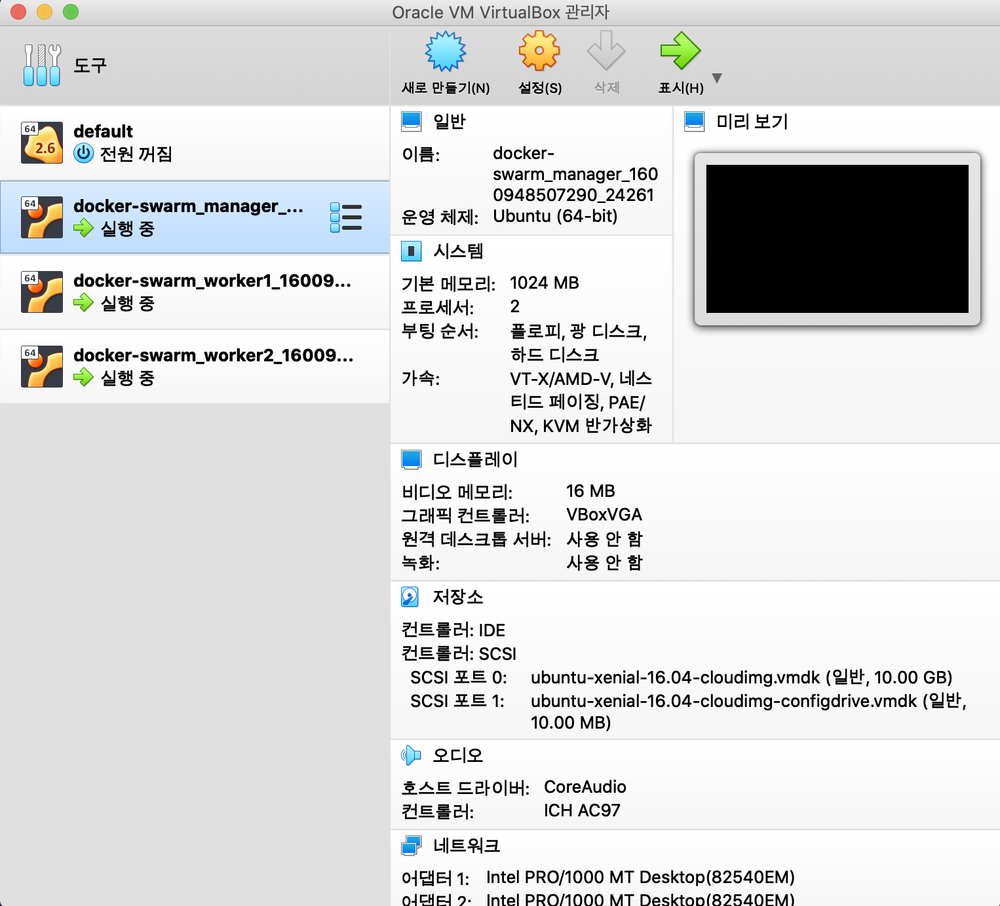

# 초보자를 위한 베이그란트
> 데이터 엔지니어 실습 시에 가장 어려운 점은 다수의 장비에 설치 및 배포하는 실습을 하기가 어렵다는 점인데, 클라우드 서비스를 활용할 수도 있지만, 비용이나 온프레미스 환경과는 다른 점이 많아 제대로된 실습이 어려운 경우가 많습니다. 이러한 경우에 로컬에 VirtualBox + Vagrant 라는 도구를 이용하면 아주 유사한 환경을 구축하여 테스트가 가능합니다

## 레퍼런스
* [Vagrant를 이용한 Docker Swarm 테스팅](https://code-machina.github.io/2019/08/07/Docker-Swarm-with-Vagrant-Part-1.html)
* [VirtualBox Download](https://www.virtualbox.org/wiki/Downloads)
* [How to enable password ssh authentication for Vagrant VM](https://stackoverflow.com/questions/45841206/how-to-enable-password-ssh-authentication-for-vagrant-vm/49477821)
* [How to enable SSH Password Authentication](https://serverpilot.io/docs/how-to-enable-ssh-password-authentication/)
* [Vagrant error ssh Permission Denied](https://www.youtube.com/watch?v=ELqNS1YBKtQ)
* [Change ubuntu passwd](https://stackoverflow.com/questions/41337802/vagrants-ubuntu-16-04-vagrantfile-default-password)
* [How to solve ssh-copy-id ERROR](https://www.poftut.com/solve-ssh-copy-id-error-failed-open-id-file-error/)
* [Vagrant ssh settings](https://www.vagrantup.com/docs/vagrantfile/ssh_settings.html)


## 1. 기본 환경 설정
### 1.1 Hombrew + VirtualBox + Vagrant 설치
* Homebrew 설치
```bash
bash> 
/usr/bin/ruby -e "$(curl -fsSL https://raw.githubusercontent.com/Homebrew/install/master/install)"
brew doctor
brew update
```
* VirtualBox 설치
  - 저는 패키지를 [VirtualBox Download](https://www.virtualbox.org/wiki/Downloads) 다운로드 하는 방법을 선호합니다
  - 
```bash
bash>
brew cask install virtualbox
```
* [Vagrant](https://medium.com/@JohnFoderaro/macos-sierra-vagrant-quick-start-guide-2b8b78913be3) 설치
```bash
bash> 
brew cask install vagrant
```
* 프로젝트 별로 파일을 구성해야 관리에 용이하므로 linux 라는 프로젝트를 하나 만들었습니다
  - 해당 경로아래에 Vagrantfile을 아래와 같이 생성 후, 기동합니다
```bash
bash>
mkdir ./linux

bash> cat linux/Vagrantfile
# -*- mode: ruby -*-
# vi: set ft=ruby :
VM_BOX  = 'ubuntu/xenial64'
NETWORK = 'forwarded_port'
GUEST_PORT = 80
HOST_PORT = 9000
Vagrant.configure(2) do |config|
  config.vm.box = VM_BOX
  config.vm.network NETWORK, guest: GUEST_PORT, host: HOST_PORT
  config.vm.provider "virtualbox" do |vb|
    vb.memory = 1024
  end
  config.vm.provision 'shell', inline: <<-SHELL
    echo 'ubuntu:ubuntu' | sudo chpasswd
  SHELL
end

bash> cd ubuntu 
vagrant up
```


## 2. 도커 스웜 구성을 위한 환경 구성
> 도커 스웜 클러스터 구성을 위해서는 최소 3대 이상의 우분투 박스를 구성해야 하므로,  조금 복잡한 환경을 구성해 봅니다

### 2.1 베이그란트를 통한 우분투 16.04 컨테이너 생성
> [Vagrant를 이용한 Docker Swarm 테스팅](https://code-machina.github.io/2019/08/07/Docker-Swarm-with-Vagrant-Part-1.html) 에서 제공하는 파일을 일부 수정하여 사용했습니다 (그대로 사용시에 vagrant ssh 접근은 가능하지만, ansible 등을 통한 설치가 어려웠습니다)

* 설정파일을 작성합니다
  - ubuntu 경로를 생성하고 Vagrantfile 파일을 아래와 같이 작성합니다
```ruby
BOX_IMAGE = "ubuntu/xenial64"  # 우분투 16.04
WORKER_COUNT = 2  # 스웜의 워커로 사용할 노드의 수를 설정합니다
MANAGER_IP_ADDRESS = "192.168.100.10"  # 서브넷 마스크 구성이 가능합니다 (manager:10, worker1:11...)

Vagrant.configure("2") do |config|
 config.vm.box = BOX_IMAGE

  # 매니저 컨테이너 구성
  config.vm.define "manager" do |subconfig|
    subconfig.vm.box = BOX_IMAGE
    subconfig.vm.hostname = "manager"
    subconfig.vm.network :private_network, ip: MANAGER_IP_ADDRESS
    subconfig.vm.network "forwarded_port", guest: 3000, host: 3500
  end

  # 워커 컨테이너 구성
  (1..WORKER_COUNT).each do |worker_count|
    config.vm.define "worker#{worker_count}" do |subconfig|
      subconfig.vm.box = BOX_IMAGE
      subconfig.vm.hostname = "worker#{worker_count}"
      subconfig.vm.network :private_network, ip: "192.168.100.#{10 + worker_count}"
      subconfig.vm.network "forwarded_port", guest: 3000, host: (3500 + worker_count)
    end
  end

  # 버추얼박스 구성
  config.vm.provider "virtualbox" do |vb|
    # Customize the amount of memory on the VM:
    vb.memory = "1024" # customize memory is required for pc
  end

  # 리눅스 패키지 업데이트 및 설치 -> 참고로 도커는 앤서블을 사용할 것이므로 제외합니다
  config.vm.provision "shell", inline: <<-SHELL
     echo "provisioning"
     # to set-up proper image running docker swarm, you should change some dependencies.....
     apt-get install \
             apt-transport-https \
       ca-certificates \
       curl \
       software-properties-common
    
    sed -i 's/PasswordAuthentication no/PasswordAuthentication yes/g' /etc/ssh/sshd_config
    systemctl restart sshd.service

    sed -i 's/ChallengeResponseAuthentication no/ChallengeResponseAuthentication yes/g' /etc/ssh/sshd_config    
    service ssh restart

    curl -fsSL https://download.docker.com/linux/ubuntu/gpg | sudo apt-key add -

    apt-key fingerprint 0EBFCD88
    add-apt-repository "deb [arch=amd64] https://download.docker.com/linux/ubuntu $(lsb_release -cs) stable"

    apt-get update
    # apt-get install -y docker-ce
    # usermod -aG docker ubuntu

  SHELL
end
```
### 2.2 컨테이너 생성 및 SSH 설정
> 우분투 기본 설정에는 PasswordAuthentication 설정이 되어 있지 않으므로 아래의 순서대로 설정합니다
* 3대의 우분투 장비 생성
  - 베이그란트 명령을 통해 장비 생성 및 접속 테스트를 수행합니다
  - 초기 구성 후에 각 장비에 접속하여 ssh 설정을 변경하고 다시 시작합니다
  - 기본 생성 계정은 vagrant 계정은 존재하며 vagrant 계정의 패스워드는 vagrant 입니다
```bash
bash> vagrant up
Bringing machine 'manager' up with 'virtualbox' provider...
Bringing machine 'worker1' up with 'virtualbox' provider...
Bringing machine 'worker2' up with 'virtualbox' provider...
==> manager: Importing base box 'ubuntu/xenial64'...
==> manager: Matching MAC address for NAT networking...
==> manager: Checking if box 'ubuntu/xenial64' version '20200923.0.0' is up to date...
==> manager: Setting the name of the VM: ubuntu_manager_1601005162866_13886
==> manager: Clearing any previously set network interfaces...
==> manager: Preparing network interfaces based on configuration...
    manager: Adapter 1: nat
    manager: Adapter 2: hostonly
==> manager: Forwarding ports...
    manager: 3000 (guest) => 3500 (host) (adapter 1)
    manager: 22 (guest) => 2222 (host) (adapter 1)
...
```
* 개별 노드에 접속하여 기본 계정설정을 합니다
  - 배포 및 구성은 ubuntu 계정으로 할 예정인데 패스워드 설정되어 있지 않아 변경이 필요합니다
  - 변경 후 IP 로 접근이 가능한 지 확인 후, 모든 워커 노드에 동일하게 패스워드를 변경합니다
  - 인증 추가를 위한 ssh-keygen 명령을 통해 설정을 수행합니다
```bash
bash> vagrant ssh manager
sudo passwd ubuntu
Enter new UNIX password:
Retype new UNIX password:
passwd: password updated successfully

bash> ssh ubuntu@192.168.100.10
Password:
Welcome to Ubuntu 16.04.7 LTS (GNU/Linux 4.4.0-190-generic x86_64)
...

bash> ssh-keygen
Generating public/private rsa key pair.
Enter file in which to save the key (/home/ubuntu/.ssh/id_rsa):
Enter passphrase (empty for no passphrase):
Enter same passphrase again:
Your identification has been saved in /home/ubuntu/.ssh/id_rsa.
Your public key has been saved in /home/ubuntu/.ssh/id_rsa.pub.
The key fingerprint is:
SHA256:Ts6bMJZpAHbq3lfgRgcyV5qcFt5loh31X1eH5/UoAfM ubuntu@manager
The key's randomart image is:
+---[RSA 2048]----+
|      ..+.*.   .o|
|    oxoO = +. . =|
|  o .+1.o   E. +=|
| . + .o .   ....+|
|  . .o oX    ..  |
| .   .o#.        |
|  .  .u.+  #     |
| . . o.1 o O     |
|  . ..  o o      |
+----[SHA256]-----+
```
* 호스트에서 패스워드 없이 접속이 가능하도록 인증파일을 추가합니다
  - 모든 서버에 추가 한 이후 패스워드 없이 접속 가능한지 테스트 합니다
```bash
bash> # ssh-copy-id 명령을 통해 호스트 인증을 노드에 추가합니다
ssh-copy-id ubuntu@192.168.100.10
ssh-copy-id ubuntu@192.168.100.11
ssh-copy-id ubuntu@192.168.100.12

bash> ssh ubuntu@192.168.100.10
Welcome to Ubuntu 16.04.7 LTS (GNU/Linux 4.4.0-190-generic x86_64)
...
```
* 앤서블이 이미 설치되어 있다면 핑을 날려볼 수 있습니다
```bash
bash> cat /etc/ansible/hosts
[manager]
192.168.100.10 ansible_user=ubuntu
[worker1]
192.168.100.11 ansible_user=ubuntu
[worker2]
192.168.100.12 ansible_user=ubuntu

bash> ansible all -m ping
192.168.100.11 | SUCCESS => {
    "ansible_facts": {
        "discovered_interpreter_python": "/usr/bin/python3"
    },
    "changed": false,
    "ping": "pong"
}
192.168.100.10 | SUCCESS => {
    "ansible_facts": {
        "discovered_interpreter_python": "/usr/bin/python3"
    },
    "changed": false,
    "ping": "pong"
}
192.168.100.12 | SUCCESS => {
    "ansible_facts": {
        "discovered_interpreter_python": "/usr/bin/python3"
    },
    "changed": false,
    "ping": "pong"
}
```

### 2.4 컨테이너 삭제
```bash
bash> vagrant destroy
    worker2: Are you sure you want to destroy the 'worker2' VM? [y/N] y
==> worker2: Forcing shutdown of VM...
==> worker2: Destroying VM and associated drives...
==> worker2: [vagrant-hostsupdater] Removing hosts
Password:
    worker1: Are you sure you want to destroy the 'worker1' VM? [y/N] y
==> worker1: Forcing shutdown of VM...
==> worker1: Destroying VM and associated drives...
==> worker1: [vagrant-hostsupdater] Removing hosts
    manager: Are you sure you want to destroy the 'manager' VM? [y/N] y
==> manager: Forcing shutdown of VM...
==> manager: Destroying VM and associated drives...
==> manager: [vagrant-hostsupdater] Removing hosts
```

